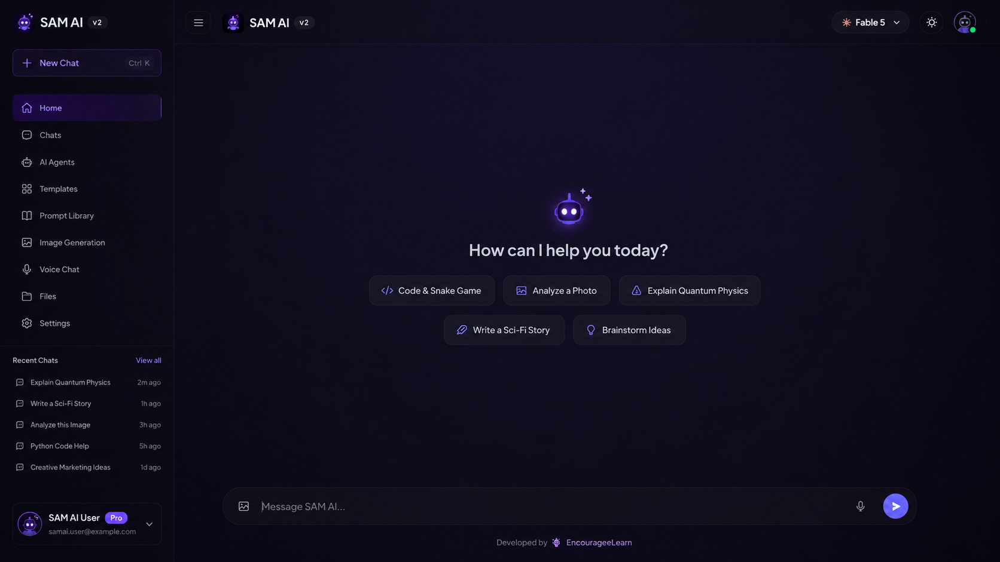

  

### ✨ Your Next-Generation, Client-Side AI Assistant

> ### 🎉 Limited-Time Offer
> **SAM AI is currently 100% free to use — no subscription, no hidden limits.**
> Try it out now before this changes: **[Launch SAM AI →](https://sam-ai-v2-psi.vercel.app/)**

# 📖 Table of Contents

- [✨ About](#-about)
- [🚀 Live Demo](#-live-demo)
- [📸 Screenshots](#-screenshots)
- [⚡ Features](#-features)
- [🧠 Multi-Provider Intelligence](#-multi-provider-intelligence)
- [🛠 Tech Stack](#-tech-stack)
- [🗺 Roadmap](#-roadmap)
- [📊 Project Status](#-project-status)
- [❤️ Support](#️-support)

# ✨ About

**SAM AI** is a modern, client-side AI assistant built for speed, simplicity, and a premium dark UI experience.

No backend lock-in, no bloated setup — just a fast, glassmorphism-styled chat interface that connects to multiple AI providers and adapts to whatever device you're on.

🔥 **Free for a limited time** — jump in now while it lasts.

<table>
<tr>
<td width="50%" valign="top">

💬 **Intelligent AI Chat**
Multiple providers, one seamless interface

🎤 **Voice Conversations**
Real-time speech-to-text + text-to-speech

📁 **File Upload Support**
Drop in documents and let SAM AI read them

🖼️ **AI Image Generation**
Create visuals right inside the chat

🔀 **Auto (Best Available) Mode**
Smart model chaining with vision fallback

</td>
<td width="50%" valign="top">

⚡ **Lightning Fast UI**
No-build-step, instant load

🌙 **Glassmorphism Dark Theme**
Premium aesthetic, easy on the eyes

📱 **Fully Mobile Responsive**
Built for phones first, scales to desktop

🌐 **Installable PWA**
Add to home screen, works like a native app

🔒 **Identity-Locked & Secure**
No cross-brand leakage between models

</td>
</tr>
</table>

# 🚀 Live Demo

## 👉 https://sam-ai-v2-psi.vercel.app/

**🔥 Free for a limited time — no sign-up cost.**

# 📸 Screenshots

## 🖥️ Desktop

🔴 🟡 🟢

## 📱 Mobile

🔴 🟡 🟢

# ⚡ Features

| | | |
|:---:|:---:|:---:|
| 💬 **AI Chat** | 🎤 **Voice** | 📁 **Files** |
| 🖼️ **Image Gen** | 🔀 **Auto Mode** | ⚡ **Fast UI** |
| 🌙 **Dark Theme** | 📱 **Responsive** | 🌐 **PWA** |
| 🔒 **Secure** | 🛡️ **Identity Lock** | 🆓 **Free (Limited)** |

# 🧠 Multi-Provider Intelligence

SAM AI isn't tied to a single model. Under the hood it can route across multiple AI providers, with an **Auto (Best Available)** mode that intelligently chains models — including vision fallback for image-capable requests — so you always get a response even if one provider is down or rate-limited.

# 🛠 Tech Stack

Built as a single-page, no-build-step web app — just open and run, deployed on **Vercel**.

# 🗺 Roadmap

- ✅ Premium Glassmorphism Chat UI
- ✅ Multi-Provider Model Integration
- ✅ Auto (Best Available) Model Chaining
- ✅ Voice Conversations
- ✅ File Upload Support
- ✅ AI Image Generation
- 🔄 AI Agents
- 🔄 Plugin Marketplace
- 🔄 Desktop Application
- 🔄 Expanded Multi-Model Support

# 📊 Project Status

🟢 **Actively Developed**

SAM AI is under active development with regular updates, UI improvements, and new AI capabilities.

**💰 Pricing:** Free for a limited time. Enjoy full access while it lasts!

# ❤️ Support

If you enjoy **SAM AI**, please consider giving this repository a ⭐.

## ⭐ Star this Repository

  

### Made with ❤️ by the SAM AI Project

